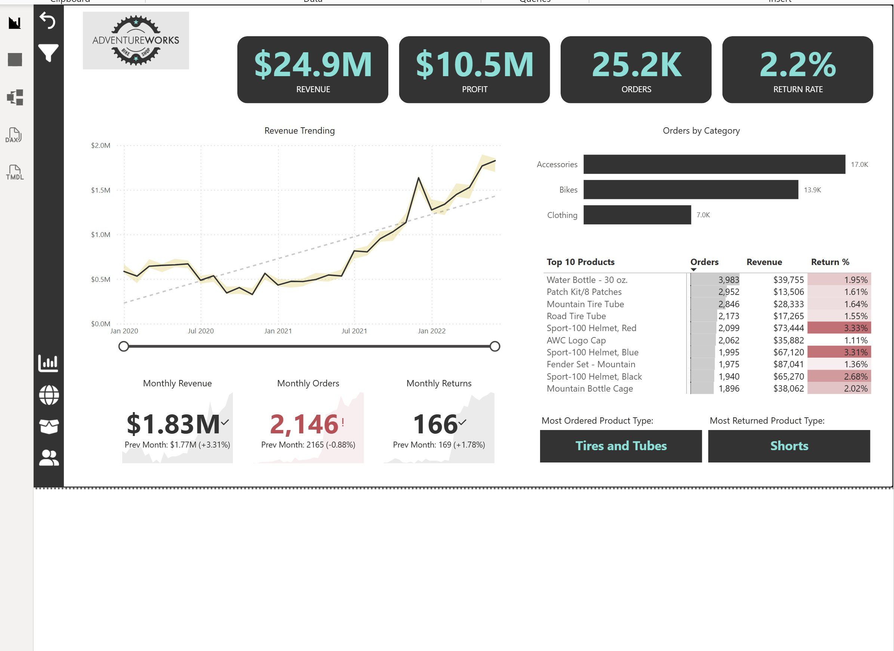

# 🚴 AdventureWorks Sales EDA

A SQL-based exploratory analysis of the AdventureWorks dataset — a fictional bike and accessories retailer. The goal was to understand overall business performance, product demand, return behaviour, and monthly trends using T-SQL queries across multiple joined tables.

## 🎯 Project Goals

- Calculate top-line business KPIs: revenue, profit, orders, and return rate
- Break down performance by product category and individual product
- Identify the most ordered and most returned product types
- Analyse monthly trends for orders, revenue, and returns
- Measure revenue growth over time using window functions

## 📁 Project Structure

```
adventureworks-eda/
├── EDA_script.sql         # All analysis queries
├── datasets/
│   ├── Sales data.csv
│   ├── Return data.xlsx
│   ├── AdventureWorks Product Lookup.csv
│   ├── AdventureWorks Product Categories Lookup.csv
│   ├── AdventureWorks Product Subcategories Lookup.csv
│   ├── AdventureWorks Calendar Lookup.csv
│   ├── AdventureWorks Territory Lookup.csv
│   └── Adventure_Works Customer Lookup.csv
├── dashboard.png          # Power BI dashboard screenshot
└── README.md
```

## 🧹 Data Notes

The raw dataset spans sales transactions from January 2020 onward across multiple lookup tables. Key relationships used:

- `Sales data` → `Product Lookup` via `ProductKey`
- `Product Lookup` → `Product Subcategories` → `Product Categories` (three-level hierarchy)
- `Returns data` → `Product Lookup` via `ProductKey`

All queries are written against SQL Server with T-SQL syntax.

## 📊 Queries Covered

| Query | Description |
|---|---|
| Total Revenue | Sum of `OrderQuantity × ProductPrice` across all sales |
| Total Profit | Sum of `OrderQuantity × (ProductPrice − ProductCost)` |
| Total Orders | Count of distinct order numbers |
| Return Rate % | Total units returned / total units ordered × 100 |
| Orders by Category | Orders, revenue, and return rate grouped by product category |
| Top 10 Products | Top products by orders, with revenue and return rate |
| Most Ordered Product Type | Subcategory with the highest order count |
| Most Returned Product Type | Subcategory with the highest return volume |
| Monthly Orders | Order count per calendar month |
| Monthly Revenue | Revenue per calendar month |
| Monthly Returns | Return volume per calendar month |
| Revenue Growth Over Time | Month-over-month revenue change and growth % using `LAG()` |
| Combined Monthly Summary | Orders, revenue, cost, profit, returns, and growth in one view |

## 📊 Dashboard Preview



Key numbers from the dashboard:
- **Total Revenue**: $24.9M
- **Total Profit**: $10.5M
- **Total Orders**: 25.2K
- **Return Rate**: 2.2%
- **Most Ordered Product Type**: Tires and Tubes
- **Most Returned Product Type**: Shorts

## 🛠️ Tech Stack

- **Database**: SQL Server
- **SQL Features**: JOINs, aggregations, CTEs, window functions (`LAG`, `OVER`), `FORMAT` for date grouping, `CROSS JOIN` for scalar comparisons

## 📌 Notes

- Revenue and profit figures are calculated directly from raw transaction data — no pre-aggregated summary tables are used.
- The `CAST(OrderQuantity AS DECIMAL(12,4))` pattern is used to avoid integer division truncation.
- Return rate is calculated at both the overall level and per category/product level.
